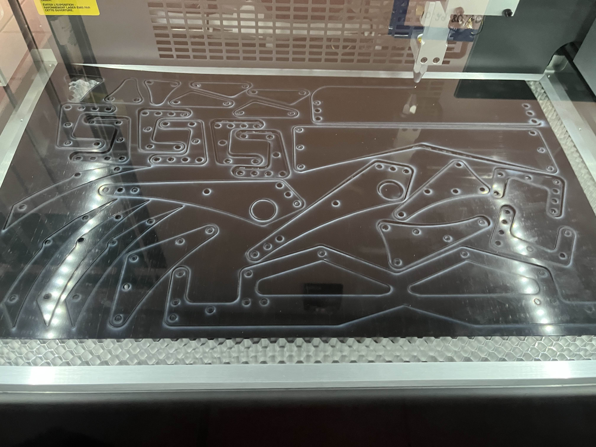

I selt-taught how to use cad programs to be compatible with CNC and Laser Cutter Softwares

<!-- truncate -->

## TL;DR

In order to complete some projects in the past, I needed to create pieces of custom polycarbonate using CNC and Laser Cutting Machines.

## UCSD Research Project

As mentioned in the project page for [the autonomous USV project](./highstakesplrs.jpg) 