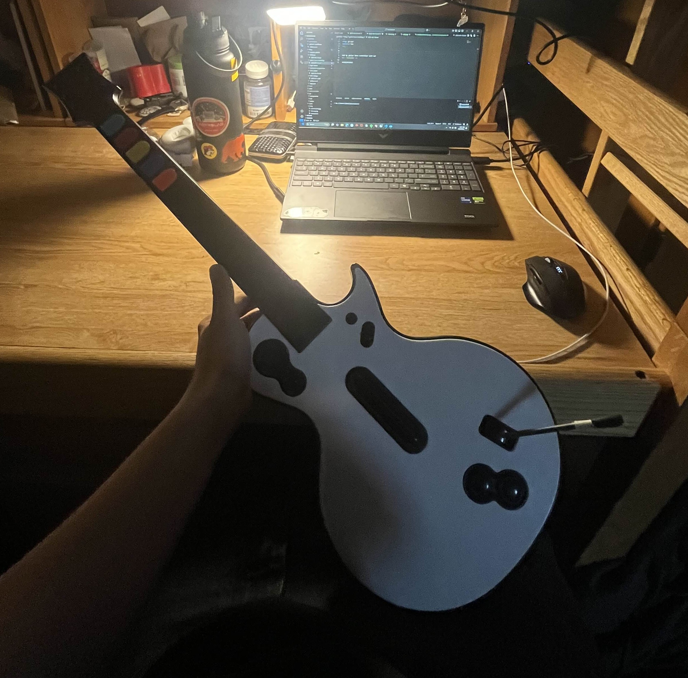
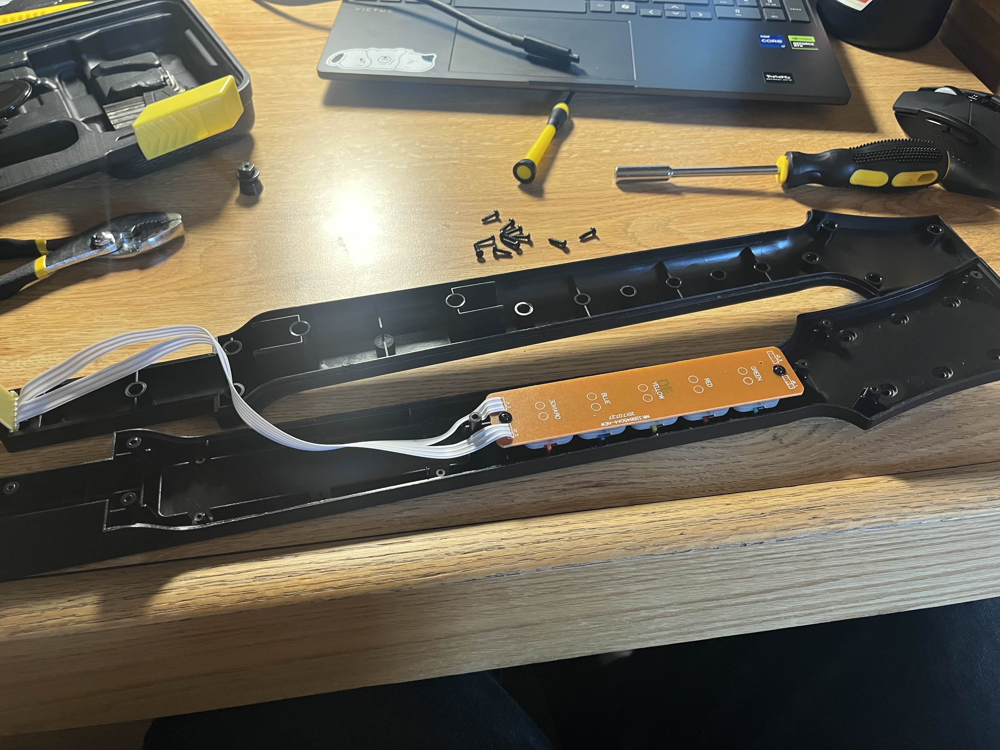
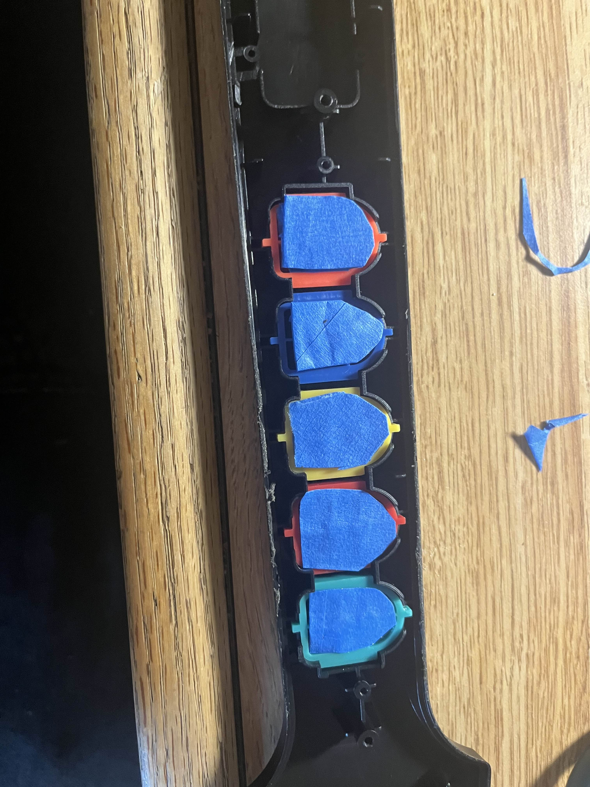
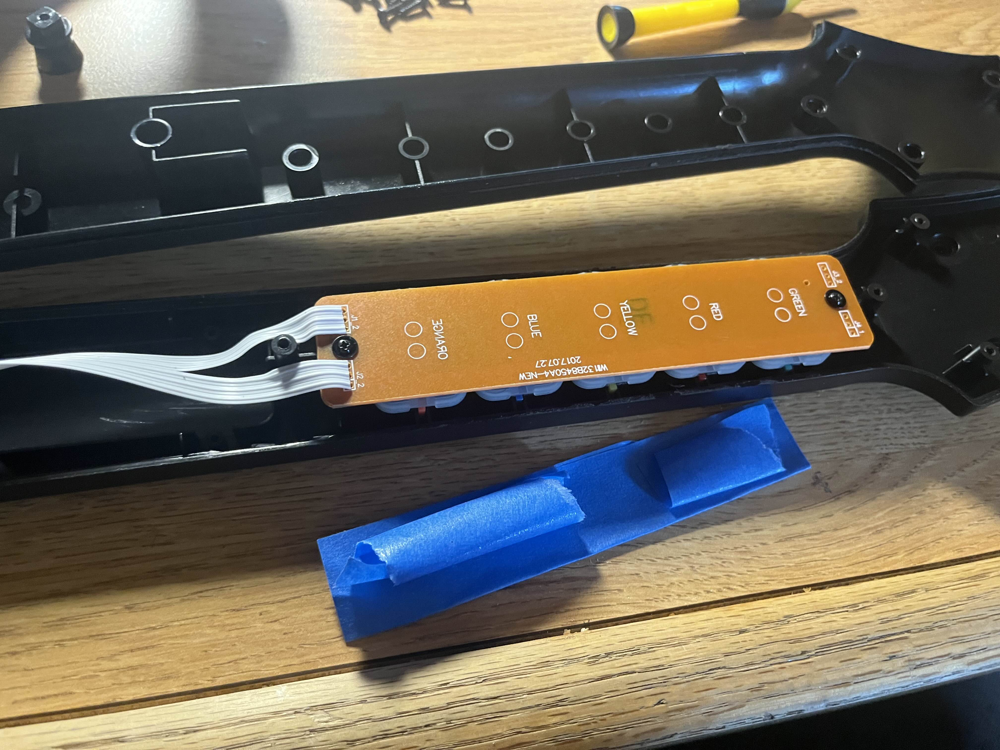

Mod my guitar hero controller with me!

<!-- truncate -->

---

This is a mod that will make the fret buttons on your guitar hero controller firmer and more responsive. You get less of that clicking / rattling sound you get when you're playing fast, and it requires less downward pressure to fret a note.

# You will need:

- Guitar Hero controller
- Small philips screwdriver
- Large-ish flat screwdriver
- Duct tape (I used painters tape)
- Scissors

This idea originally is not originally mine, but the applications I used were different than most guides so I am including it here :)

## Step 1: Remove All Screws in the Guitar Neck

After removing the neck from the guitar body, remove all the screws from it (excluding the one holding on the strap button, unless you don't use it, and want to remove it - I did here).

## Step 2: Open Neck and Dismantle Fret Button Assembly

  <figure id="fig-1" style={{ margin: 0 }}>
    
    <figcaption style={{ textAlign: 'center', marginTop: '0.5rem', fontStyle: 'italic' }}>
     
    </figcaption>
  </figure>

  <figure id="fig-1" style={{ margin: 0 }}>
    
    <figcaption style={{ textAlign: 'center', marginTop: '0.5rem', fontStyle: 'italic' }}>
    
    </figcaption>
  </figure>

First, remove the two screws holding the brown circuit board down, using a small philips screwdriver.

Carefully lift the circuit board and set it aside. Be particularly careful not to trap or fold the ribbon cable at any point as it's quite delicate.

Remove the  rubber pad from the buttons, and set it aside - this will reveal the fret buttons. You can now remove these too.

## Step 3: Make Your Spacers

  
  <figure id="fig-1" style={{ margin: 0 }}>
    
    <figcaption style={{ textAlign: 'center', marginTop: '0.5rem', fontStyle: 'italic' }}>
     
    </figcaption>
  </figure>

  <figure id="fig-1" style={{ margin: 0 }}>
    
    <figcaption style={{ textAlign: 'center', marginTop: '0.5rem', fontStyle: 'italic' }}>
    
    </figcaption>
  </figure>

Start by sticking two pieces of duct tape together, adhesive sides facing each other. This is what the spacers are made out of.

Personally I found 2 layers of tape was perfect, but if you feel more is needed (or you are using tape of a different thickness) then use more or fewer layers. I would suggest 2 to start with - if 2 is too much (you'll be able to tell this after reassembling the guitar and playing with it) then I would suggest buying some thinner tape and using that.

Cut strips of the tape that are 1.5cm wide. Then cut these every 2cm until you get 5 pieces of tape that measure 1.5 x 2cm.

Lay each one on a button to make sure that you're cutting was accurate, and there are no overlaps - the spacer should fit completely on the button, with no overhangs. If so, the button's movement may be impaired.

## Step 4: Attatch Spacers

  
  <figure id="fig-1" style={{ margin: 0 }}>
    
    <figcaption style={{ textAlign: 'center', marginTop: '0.5rem', fontStyle: 'italic' }}>
     
    </figcaption>
  </figure>

  <figure id="fig-1" style={{ margin: 0 }}>
    
    <figcaption style={{ textAlign: 'center', marginTop: '0.5rem', fontStyle: 'italic' }}>
    
    </figcaption>
  </figure>

Make 5 small balls of your blu-tack (or equivalent, I used folded tape). Don't make these too big as too much will make the spacer's surface uneven - see the picture for an idea of size.

Roll one small sections of tape between your fingers to make a sausage shape, and press it along the center line and 2 holes in the plastic on the back of one of the fret buttons. Then attach a spacer to this, ensuring it is central to the button and not overlapping the sides at all.

Do this for all five buttons.

## Step 5: Reassemble the Fret Button Assembly

 

Place the fret buttons back into the neck, in the correct order. The correct order (starting from the head of the guitar) is green, red, yellow, blue, orange.

Lay the blue rubber piece over the buttons, pressing it into place, and ensuring it is fitted correctly.

Line up the circuit board and gently press each end to get the plastic screw posts through the holes in the circuit board. Then put the screws you removed earlier back in.

Along with this, the plastic on the back half of the neck is supposed to sandwich the circuit board to stop it bending. Despite this, i found that if you press a button hard, the circuit board will still bend to some degree, causing the buttons to move in a bit more than they should.

So to make the buttons firmer still, add a length of duct tape (torn to a smaller width) to the back of the circuit board as seen in the picture. This seems to help quite a lot in my opinion.

## Step 6: Reassemble Guitar

Replace the rear half of the neck, ensuring that the ribbon cable doesn't get trapped between the screw posts. If it does you could damage the wires inside.

Put all 9 screws back in using the Torx screwdriver.

Reattach the neck to the guitar, and test it to make sure everything works. If the movement is too restricted, use thinner tape. If you want to reduce movement more, then make more spacers, but using 3 layers of tape instead of 2.

Enjoy!