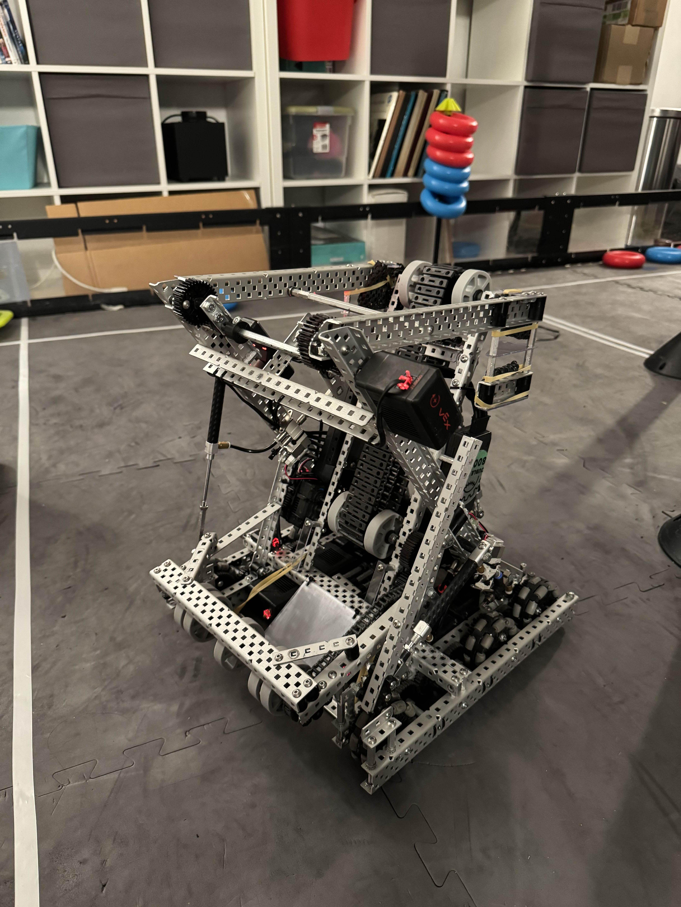
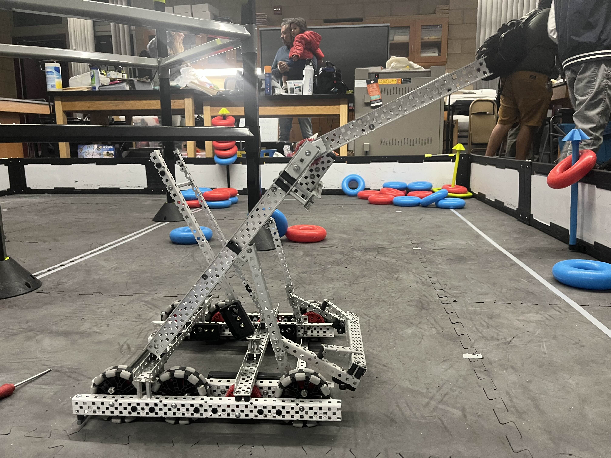
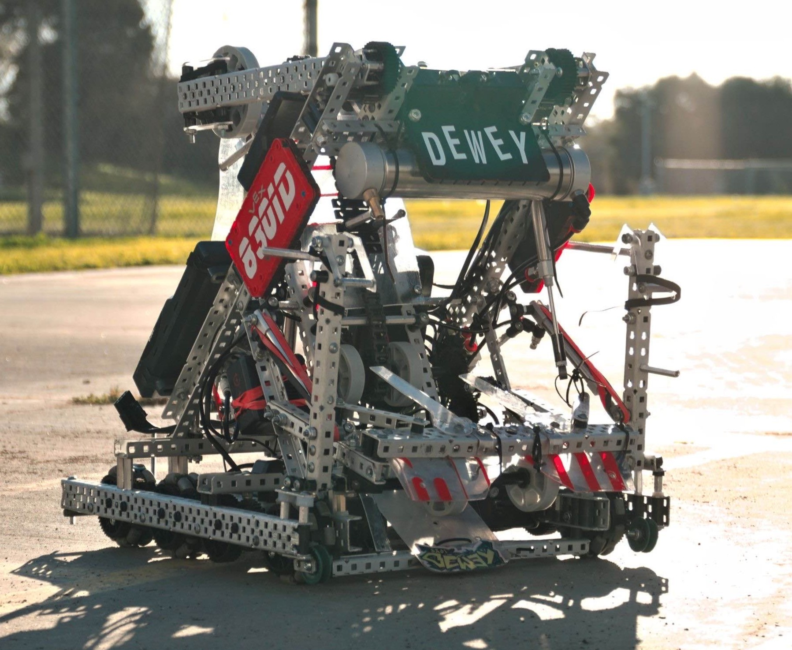
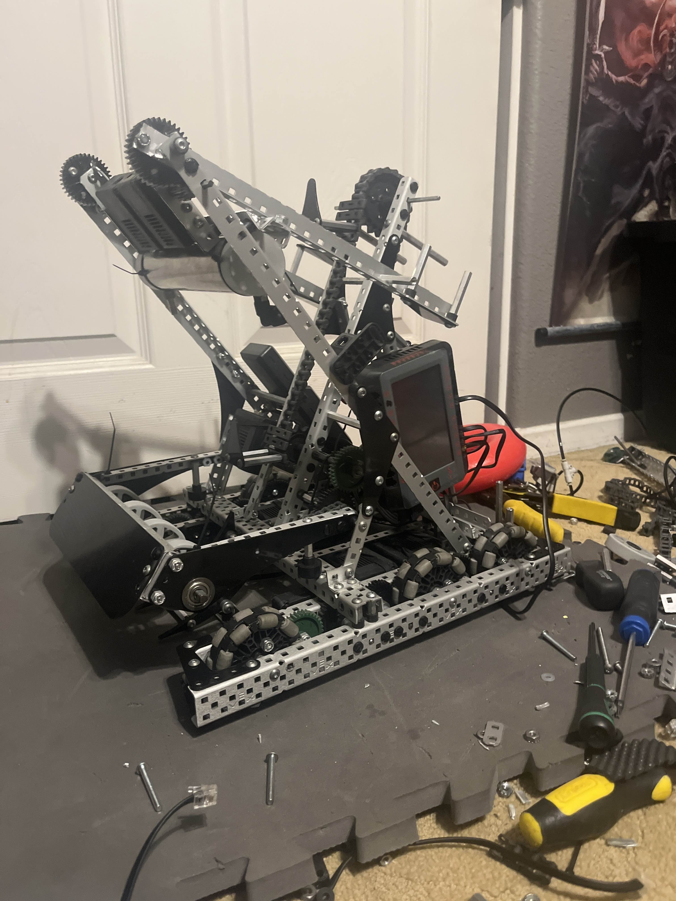
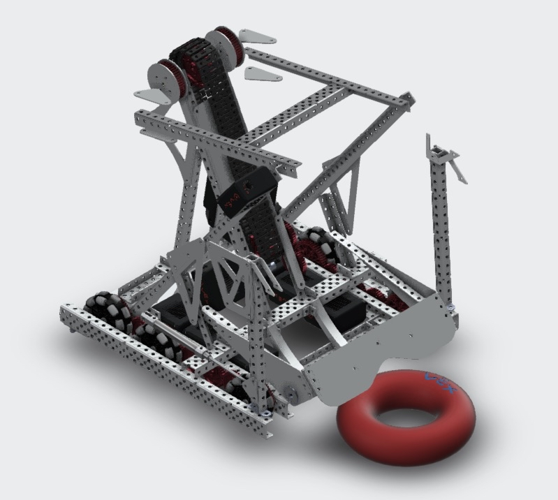

import useBaseUrl from '@docusaurus/useBaseUrl';

My collection of robot designs and iteration history throughout the 2024–2025 VRC High Stakes Season

<!-- truncate -->

---

## TL;DR

Here is the collection of iterations and robot designs throughout the season

  <figure id="fig-1" style={{ margin: 0 }}>
    
    <figcaption style={{ textAlign: 'center', marginTop: '0.5rem', fontStyle: 'italic' }}>
      Figure 1 — First Iteration
    </figcaption>
  </figure>

  <figure id="fig-2" style={{ margin: 0 }}>
    
    <figcaption style={{ textAlign: 'center', marginTop: '0.5rem', fontStyle: 'italic' }}>
      Figure 2 — Second Iteration
    </figcaption>
  </figure>

  <figure id="fig-3" style={{ margin: 0 }}>
    
    <figcaption style={{ textAlign: 'center', marginTop: '0.5rem', fontStyle: 'italic' }}>
      Figure 3 — Third Iteration
    </figcaption>
  </figure>

  <figure id="fig-4" style={{ margin: 0 }}>
    
    <figcaption style={{ textAlign: 'center', marginTop: '0.5rem', fontStyle: 'italic' }}>
      Figure 4 — Fourth Iteration
    </figcaption>
  </figure>

  <figure id="fig-5" style={{ margin: 0 }}>
    
    <figcaption style={{ textAlign: 'center', marginTop: '0.5rem', fontStyle: 'italic' }}>
      Figure 5 — Fifth Iteration
    </figcaption>
  </figure>

  <figure id="fig-6" style={{ margin: 0 }}>
    
    <figcaption style={{ textAlign: 'center', marginTop: '0.5rem', fontStyle: 'italic' }}>
      Figure 6 — Sixth Iteration
    </figcaption>
  </figure>

---

# Intro to High Stakes

This year’s competition challenge was centered around developing a robot capable of scoring rings, manipulating mobile goals around a field, and elevating itself at the end of a match.

With this in mind, when analyzing the field, there is:

- Forty-eight (48) Rings  
- Five (5) Mobile Goals  
- Four (4) Wall Stakes  
- One (1) Ladder  

One side of the Field Perimeter is marked with:

- Two (2) Positive Corners  
- Two (2) Negative Corners  

Points can be scored on any kind of **Stake** throughout the field using blue and red **Rings** placed throughout the field. Six (6) Rings can fit on any given stake (except Wall Stakes, which can only fit two).

---

## First Iteration V1.0

[Google Photos Album](https://photos.app.goo.gl/LcjJyR2y14UPvnTc6)

Early in the season, I began researching robot designs and identified four essential components:

- An intake  
- A clamp for mobile goals  
- A mechanism to score on stakes other than mobile goals  
- A method for elevation during the endgame  

The first robot design I developed only featured two of these four goals. Due to time constraints, I accepted the trade-off and moved forward with a simplified build.

# Drivetrain

I decided to use a standard drivetrain speed of 480 RPM using a 36-48 (19:24) gear ratio on 2.75" omni wheels and an offset traction wheel. This was a drivetrain I was very comfortable using since it was similar to my [Spin Up](https://www.youtube.com) season drive train at worlds.

# Intake and Clamp Mechanism

I decided to design a conveyer-style intake inspired by my previous experience in [Tipping Point](https://www.youtube.com) intaking rings, using "hooks" to grab onto each ring and flip them onto goals to score them.

For the clamp mechanism, I was inspired by collaborating with [VURC Team OSCR](https://www.youtube.com/@theflyingcuber) in designing this clamp and implementing it onto the robot.

  <figure id="gif-1" style={{ margin: 0 }}>
    
    <figcaption style={{ textAlign: 'center', marginTop: '0.5rem', fontStyle: 'italic' }}>
      CAD Design
    </figcaption>
  </figure>

  <figure id="fig-2" style={{ margin: 0 }}>
    
    <figcaption style={{ textAlign: 'center', marginTop: '0.5rem', fontStyle: 'italic' }}>
      Implementation
    </figcaption>
  </figure>

Despite its limitations, this robot performed well in competition, earning qualifying awards and securing our placement at the state level early in the season.

# V1.1

After the first two competitions, we attempted to add a lift mechanism inspired by the [MJS Lift Mechanism](https://www.youtube.com/watch?v=cXMNPDNUUeU). The goal was to score on Wall Stakes and Alliance Stakes. Unfortunately, the design was only tested for two days before being scrapped in favor of planning the next iteration.

finish talking about liftttttttttttttttttt hereeeeeee

---

## Second Iteration V2.0

[Google Photos Album](https://photos.app.goo.gl/r3WCAA22tLft5pPe8)

Our second iteration was one of our most successful builds, competing in three events. It achieved three out of the four original goals and introduced a new lift mechanism known as the ["Lady Brown" mechanism](https://www.youtube.com/shorts/0qKV4nqYBG8).

# Lady Brown Mechanism

Planning:

- Wanted to use CAD to create correct geometry for loading and scoring  
- Wanted to use minimal metal to reduce weight for competition robot  
- Needed to be fast enough to...

This mechanism was designed to intercept rings during intake and rotate them into scoring position on Wall Stakes. In order for this design to work, it neede to have correct geometry relative to the intake and the wall stake, because common issues we found while testing was the lift being able to grab the ring,  but not score it, or that it could score but not grab the rings. 

  <figure id="gif-1" style={{ margin: 0 }}>
    
    <figcaption style={{ textAlign: 'center', marginTop: '0.5rem', fontStyle: 'italic' }}>
      Cad master sketch used to develop finalized design, featuring a ring path sketch and mock Wall Stakes to see positions relative to each other.
    </figcaption>
  </figure>

  <figure id="fig-2" style={{ margin: 0 }}>
    
    <figcaption style={{ textAlign: 'center', marginTop: '0.5rem', fontStyle: 'italic' }}>
      Implementation and showcase on Iteration V3.0
    </figcaption>
  </figure>

  

The tuning and troubleshooting for this design focused on the plastic pieces and mesh that the mechanism used (shown below):

  <figure id="fig-1" style={{ margin: 0 }}>
    
    <figcaption style={{ textAlign: 'center', marginTop: '0.5rem', fontStyle: 'italic' }}>
     I came up with solutions using different amounts of mesh and rubber bands to dictate the "hold" of the arm.
    </figcaption>
  </figure>

 Throughout the season, we continued with this method for other iterations of the arm.

# Improved Clamp

When deciding to make changes for this design compared to **V1.0**, we realized the general idea of a locking clamp worked extremely well in competition. To reduce weight, we redesigned a sleeker clamp. The locking clamp helped secure mobile goals and supported our strategy of goal stealing.

To make the clamp lock, we opted to use an **over-centered joint** to ensure that the pistons pushing the mechanism would not fail to hold the goal even while scoring rings. Because of this decision, we were able to "out-clamp" other robots and actually steal goals from there, making us known for this kind of defensive play worldwide.

  <figure id="gif-1" style={{ margin: 0 }}>
    
    <figcaption style={{ textAlign: 'center', marginTop: '0.5rem', fontStyle: 'italic' }}>
      Stolen goal 1
    </figcaption>
  </figure>

  <figure id="fig-2" style={{ margin: 0 }}>
    
    <figcaption style={{ textAlign: 'center', marginTop: '0.5rem', fontStyle: 'italic' }}>
      Stolen Goal 2
    </figcaption>
  </figure>

---

## Third Iteration V3.0

[Google Photos Album](https://photos.app.goo.gl/RBLASxhf9kDQT6HdA)

For the fourth iteration of the robot, we wanted to optimize the build of the robot. The other two iterations have proven to be succesful in concept, all having a **clamp, intake, and lift** so I opted to do a complete overhaul fo the design to test out some new ideas, since we had a large gap before state championships

# Design Challenges

With this design I focused on redoing three main components:

- The drive
- The clamp
- The lift

# New Drivetrain

For this new drive, we wanted to test a drive speed I was familiar with competing in the Over Under Season, having a 450 RPM drive speed on 3.25" wheels roughly coming out to ~8.1 Ft/s. This was a big increase in overall speed, but after studying other competitions and our own experience, we knew how great of a factor having manuverability throughout the field was so we opted to redesign to this speed. 

This drive was a big change, as it not only changed the speed, but it also had a new center of gravity to manage. This game challenge required you to carry a varying mobile goal on your back, so some of the initial issues was whenever we moved it would feel like a big weight on our backs swinging us around. In order to solve this, we replaced the center omni wheels for traction wheels to regain more control.

# New Lady Brown

After collaborating with some friends from other teams through a discord community I helped to manage (**Vex Learning Alliance**), we concluded that shifting out Lady Brown mechanism to not just have a limited rotation, which it currently did to maximize effectiveness on wall stakes, to instaed have a full 360 degree rotation for greater versatility. 

This decision was based on the idea that we could:

- Flip/unflip goals from opponents in matches
- Score more effectively on wall Stakes
- We could also score on the alliance stake without just using our intake.

For designing this, we opted to continue using the cad design mentioned earlier, creating a master sketch that included the new geomtery we needed for our wheels and the new mesh that would be needed for another idea I had. 

  <figure id="fig-1" style={{ margin: 0 }}>
    
    <figcaption style={{ textAlign: 'center', marginTop: '0.5rem', fontStyle: 'italic' }}>
      Full ROM of new arm
    </figcaption>
  </figure>

  <figure id="fig-2" style={{ margin: 0 }}>
    
    <figcaption style={{ textAlign: 'center', marginTop: '0.5rem', fontStyle: 'italic' }}>
      Mesh and Ring holder
    </figcaption>
  </figure>

When planning for our new arm, we were mainly focused qualifying to worlds through the skills challlenge, *a 60 second version of the game challenge where you play solo as opposed to 2v2*, and realized that the highest scoring routes score two rings ont he outside wall stakes instaed of just one for top ring value, so we wanted to design a **double ring holder** on our lady brown to cut this time deficit and maximize our efficeincy.

# New Clamp

While our previous designs of having a locking clamp on our robot were effective, we realized that it was also very heavy. So we opted to redesign into a simpler design based on our friends at [6627X](https://www.youtube.com/@6627X) with their design for a clamp below.

  <figure id="fig-1" style={{ margin: 0 }}>
    
    <figcaption style={{ textAlign: 'center', marginTop: '0.5rem', fontStyle: 'italic' }}>
      6627X Clamp
    </figcaption>
  </figure>

  <figure id="fig-2" style={{ margin: 0 }}>
    
    <figcaption style={{ textAlign: 'center', marginTop: '0.5rem', fontStyle: 'italic' }}>
      My Clamp
    </figcaption>
  </figure>

So, for our design we came up with this since it fit our robots geometry best while maximizing the weight reduced. 

Overall, these changes helped our robot to perform significantly well as we prepared to test in competition and scrimmages throughout the next few months.

---

## Fourth Iteration V4.0

[This robot is included in the same folder as 3.0](https://photos.app.goo.gl/RBLASxhf9kDQT6HdA)

After competing with the new drive train, we opted that it was a good solution to speed, the issue was the control. Along with this, I concluded the tradeoff for having the double lady brown was not worth the effectiveness in matches, since it was not effective at descoring rings which were essential in maintaining control of the high stakes

# Design Choices

So because of this, we opted to:

- Revert the drive to the old 3.25" wheels
- Revert the lady brown to be single hold
- Redo the hold for the lady brown
- Add odometry functionality to the robot for consistency

# Lady Brown changes

We had found at our recent competition, that despite the double lady brown being effective, it could be better remaining single and simply doing the motion twice for scoring. Because of this, I redesigned the plastic holder and the method for holding rings, using a foam strip instead of the typical mesh and rubber band combo.

  <figure id="fig-1" style={{ margin: 0 }}>
    
    <figcaption style={{ textAlign: 'center', marginTop: '0.5rem', fontStyle: 'italic' }}>
      New hold angle to allow for easier scoring
    </figcaption>
  </figure>

  <figure id="fig-2" style={{ margin: 0 }}>
    
    <figcaption style={{ textAlign: 'center', marginTop: '0.5rem', fontStyle: 'italic' }}>
      New foam ring hold method
    </figcaption>
  </figure>

# Odometry Implementation

Odometry is a method for tracking a robot’s position and orientation on the field using sensor data. By measuring how far wheels have rotated and combining that with heading information (often from an inertial sensor), the robot can calculate its exact location in real time — like GPS, but self-contained.

*In VEX, odometry typically uses:*
- **Tracking wheels** (often unpowered) to measure linear movement
- **Inertial sensors (IMU Encoders)** to track rotation
- **Math algorithms** (trigonometry + vector updates) to compute position

This setup allows your robot to know its coordinates and angle at any moment during autonomous routines.

*Implementing odometry assists in:*
- **Precise autonomous navigation** — no more guesswork or dead reckoning
- **Smooth path following** — even curved or complex routes
- **Consistent performance** — across matches and field conditions

Instead of relying solely on timed movements or encoder values, odometry lets your robot adapt and correct its path dynamically. That’s a game-changer for skills runs and advanced autonomous strategies.

Example autonomous routines with and without odometry:

  <figure id="fig-1" style={{ margin: 0 }}>
    
    <figcaption style={{ textAlign: 'center', marginTop: '0.5rem', fontStyle: 'italic' }}>
      Only using PID functionality, relative movements
    </figcaption>
  </figure>

  <figure id="fig-2" style={{ margin: 0 }}>
    
    <figcaption style={{ textAlign: 'center', marginTop: '0.5rem', fontStyle: 'italic' }}>
      Implementation of odometry, absolute movements
    </figcaption>
  </figure>

For the implementation of this onto the robot, we had to design trackign wheels for the robot, in which we designed custom plastic and custom metal pieces to house the trackign wheels with each neccesary rotation sensor. 

  <figure id="fig-1" style={{ margin: 0 }}>
    
    <figcaption style={{ textAlign: 'center', marginTop: '0.5rem', fontStyle: 'italic' }}>
     
    </figcaption>
  </figure>

  <figure id="fig-2" style={{ margin: 0 }}>
    
    <figcaption style={{ textAlign: 'center', marginTop: '0.5rem', fontStyle: 'italic' }}>
      Odom Pod Mounting
    </figcaption>
  </figure>
  
  <figure id="fig-1" style={{ margin: 0 }}>
    
    <figcaption style={{ textAlign: 'center', marginTop: '0.5rem', fontStyle: 'italic' }}>
     
    </figcaption>
  </figure>

With the implementation of this function, I was able to maintain consistent autonomous routines and position trackings throughout the competitions we took this robot too

---

## Fifth Iteration V5.0

[Google Photos Album](https://photos.app.goo.gl/LcjJyR2y14UPvnTc6)

For this iteration of the robot, I opted for a complete overhaul of the design, to reduce weight and to redo the gemotry of our intake, clamp, and lift. Along with this, we wanted to add a hanging mechanism, so I deisnged custom plastic to optimize the angle for it.

# Design Planning

- New bot from scratch
- Reduce weight as much as possible in main structures
- Implement custom plastic throughout the robot
- Implement mechanism for elevation

# Designing new robot

For designing the new robot, I wanted to keep the same general idea dn geometry since it had worked for us on our last robot, simply changing the pieces used to reduce weight. To accomplish this I designed the full robot in CAD before building it which is shown below

This cad only served as a hypothetical piece, as most of the plastic on the real robot was redone (but i dont have access to the file anymore) and so I began building it in the short 1 week period I had

# Custom plastic

A more in depth overview of how this was developed can be found at [Creating Custom Plastic with Laser Cutting and CNC](https://photos.app.goo.gl/LcjJyR2y14UPvnTc6) however this was the finished product for the plastic I developed which was used in the:
- Structure of the robot towers for intake and lsit
- Intake structure and wedge for rings
- Ring hold for lift
- Ring Drive wedges
- And more

  <figure id="fig-1" style={{ margin: 0 }}>
    
    <figcaption style={{ textAlign: 'center', marginTop: '0.5rem', fontStyle: 'italic' }}>
     Finished delring plastic on laser cutter
    </figcaption>
  </figure>

These were mounted onto the robot with a combination of aluminum nuts and plastic screws, which both served to reduce weight compared to all hardware being steel.

# Testing and Finished Robot

Throughout the constructing process, I was worried about robot functionality, and thus I extensively tested each mechanism in different simulations to ensure that isseus would not occur during matches or during our skills routine. Not only this, but my programmer and good friend [Matthew Sarzoza](https://www.linkedin.com/in/dominic-lopez-39715527a/) wanted to maximize effieincy of our programming section, so he worked tirelessly to provide 100+ programmign test runs to ensure efficiency and consistency.

  <figure id="fig-1" style={{ margin: 0 }}>
    
    <figcaption style={{ textAlign: 'center', marginTop: '0.5rem', fontStyle: 'italic' }}>
     Testing intake wedge to intake specific rings based on color (and a lil thumbs-up)
    </figcaption>
  </figure>

Not only was making this wedge important, but making the structure of the whole intake robust was a main focus

  <figure id="fig-1" style={{ margin: 0 }}>
    
    <figcaption style={{ textAlign: 'center', marginTop: '0.5rem', fontStyle: 'italic' }}>
     
    </figcaption>
  </figure>

  <figure id="fig-1" style={{ margin: 0 }}>
    
    <figcaption style={{ textAlign: 'center', marginTop: '0.5rem', fontStyle: 'italic' }}>
     
    </figcaption>
  </figure>

<figure id="fig-1" style={{ margin: 0 }}>
    
    <figcaption style={{ textAlign: 'center', marginTop: '0.5rem', fontStyle: 'italic' }}>
     
    </figcaption>
  </figure>

<figure id="fig-1" style={{ margin: 0 }}>
    
    <figcaption style={{ textAlign: 'center', marginTop: '0.5rem', fontStyle: 'italic' }}>
     
    </figcaption>
  </figure>

These implementations allowed for the optimal structure since everything was integrated with each other, maximizing redundancy for structural integrities.

## Conclusion

Throughout this competition season, I broadened my technical skills by self-teaching odeometric functions and their implementations, incorporating new machinign techniques, and new CAD skills I can apply to other projects.