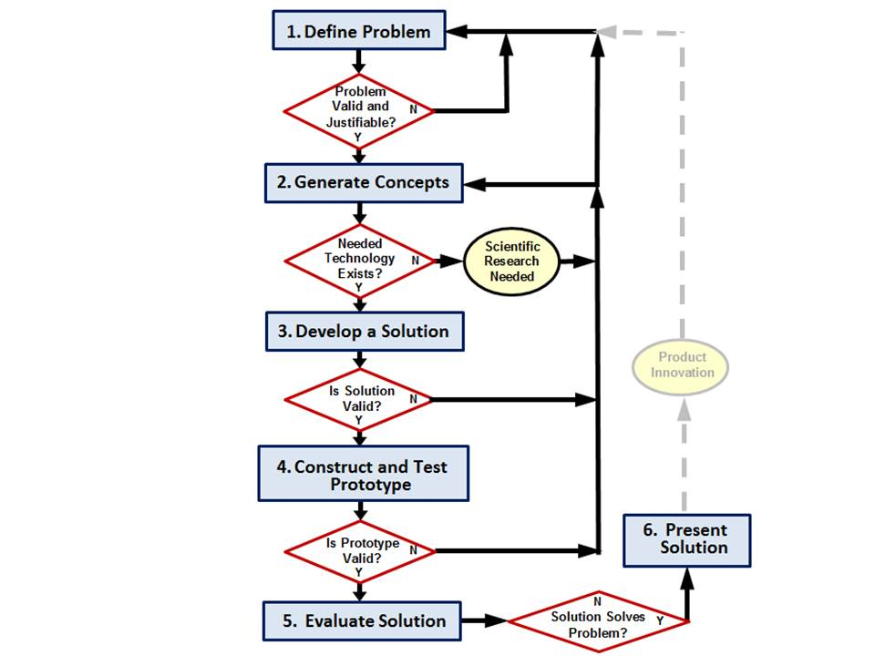

Collection of my notebooks throughout my Vex Robotics Career

  <figure id="fig-1" style={{ margin: 0 }}>
    
    <figcaption style={{ textAlign: 'center', marginTop: '0.5rem', fontStyle: 'italic' }}>
     
    </figcaption>
  </figure>

<!-- truncate -->

---

# Index

- What is an engineering notebook?
- How did I apply it to my VRC Experience?
- How has it evolved and helped me through the years?
- How do I apply the lessons I learned from it?

---

## What is an Engineering Notebook?

For real world engineering notebooks its ...

My experience working with them has mainly been through Vex, or Vex Robotics Competition, where the **engineering notebook** serves as a season-long (year long), journal that documents a robotics team's **engineering design process**. It serves as a tool for reflection, iteration, and resource management for the team as it allows them to create and use a management framework for their operations. 

# Key Parts of an engineering notebook

The major parts of the notebooks in vex were focused on the 6 steps of the E.D.P:

- **Defining the problem:** Typically refering to game or design challenges in context of vex
- **Brainstorming and reasearching solutions:** Researching and brainstorming design and solution options
- **Selecting the best solution and Planning for it:** Picking the best brainstormed solutions and creating living and working timeline for accomplishing said goal, allocating reasources as neccesary
- **Building the solution:** Constructing said solution
- **Testing the solution:** Running structrued tests to gain quantative data to then compare and contrast its performance to other designs/robots
- **Repeating process as neccesary:** If tests come up different than expected, repeat process by defining new problem.

This Process can be applied outside of just VRC engineering, as it is the main framework for problem solving as an engineer in a  professional setting. 

## How did I apply it through my experience in VRC?

Well since the E.D.P is a problem solving process, it was applied to come up with a robot design for every season I competed in. We would always begin in the linear structure of teh rubric, which followed each step chronologically.

### Defining the Problem

For us to accurately define the problem for a game overall, analyzing the information that was presented was essential to success. We split this up into two main ways: **quantative analysis**, and **strategical analysis**. Our two main focuses were how we could maximize point scoring by analyzing how to score points and weighing which played more importance to us, then how these decisions would affect possible match, autonomous, and skills match strategies.

  <figure id="fig-1" style={{ margin: 0 }}>
    
    <figcaption style={{ textAlign: 'center', marginTop: '0.5rem', fontStyle: 'italic' }}>
     Analysis of how rings on MoGo's impact scoring
    </figcaption>
  </figure>

  <figure id="fig-1" style={{ margin: 0 }}>
    
    <figcaption style={{ textAlign: 'center', marginTop: '0.5rem', fontStyle: 'italic' }}>
     Analysis of how elevation points impact this game
    </figcaption>
  </figure>

  <figure id="fig-1" style={{ margin: 0 }}>
    
    <figcaption style={{ textAlign: 'center', marginTop: '0.5rem', fontStyle: 'italic' }}>
     Example of autonomous constraints and proposed strategy
    </figcaption>
  </figure>

<figure id="fig-1" style={{ margin: 0 }}>
    
    <figcaption style={{ textAlign: 'center', marginTop: '0.5rem', fontStyle: 'italic' }}>
     Overall analysis of game and robot challenges/constraints
    </figcaption>
  </figure>

### Brainstorm and Research 

In brainstorming, I would always try to throw out every idea I had initially, no matter how outrageous, and then finish by condensing it to three realistic concepts. I would collaborate with other teams on discord like the **Vex Learning Alliance** or the **SoCal Robotics Alliance** to bounce ideas off of other high performing teams and like minded individuals. From there, I would usually scour Youtube or BiliBili to become inspired by national and international teams to finalize a few ideas. Below you can see examples of this research from past notebooks.

  <figure id="fig-1" style={{ margin: 0 }}>
    
    <figcaption style={{ textAlign: 'center', marginTop: '0.5rem', fontStyle: 'italic' }}>
     Analysis of how rings on MoGo's impact scoring
    </figcaption>
  </figure>

  <figure id="fig-1" style={{ margin: 0 }}>
    
    <figcaption style={{ textAlign: 'center', marginTop: '0.5rem', fontStyle: 'italic' }}>
     Analysis of how elevation points impact this game
    </figcaption>
  </figure>

  <figure id="fig-1" style={{ margin: 0 }}>
    
    <figcaption style={{ textAlign: 'center', marginTop: '0.5rem', fontStyle: 'italic' }}>
     Example of autonomous constraints and proposed strategy
    </figcaption>
  </figure>

<figure id="fig-1" style={{ margin: 0 }}>
    
    <figcaption style={{ textAlign: 'center', marginTop: '0.5rem', fontStyle: 'italic' }}>
     Overall analysis of game and robot challenges/constraints
    </figcaption>
  </figure>

<!-- 

# How did I apply the lessons I learned from this?

Well after being involved in VRC for so many years, this structured form of time management became the norm for me in my own life. Whenever I was working on a project of an assingment, I would apply the E.D.P and make a short, structured document that I could keep track of progress of.  -->
